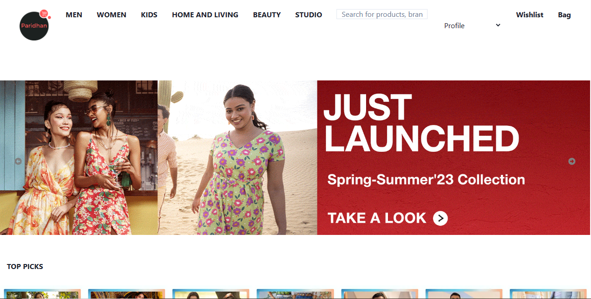
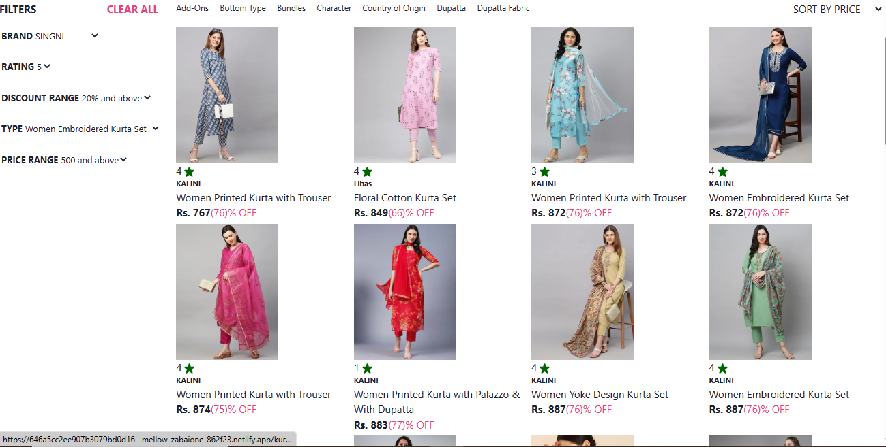
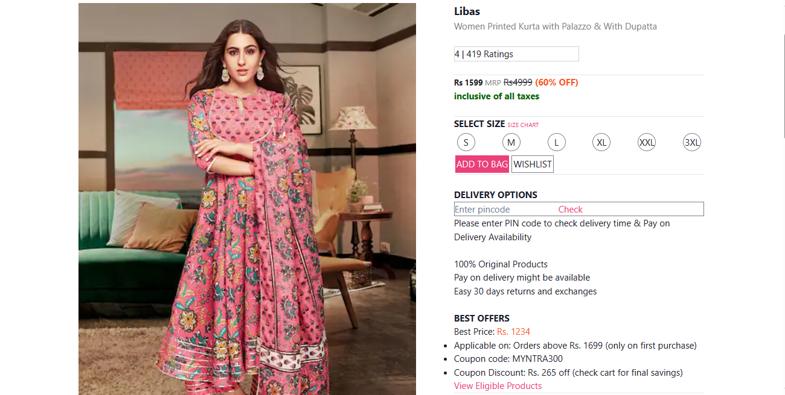
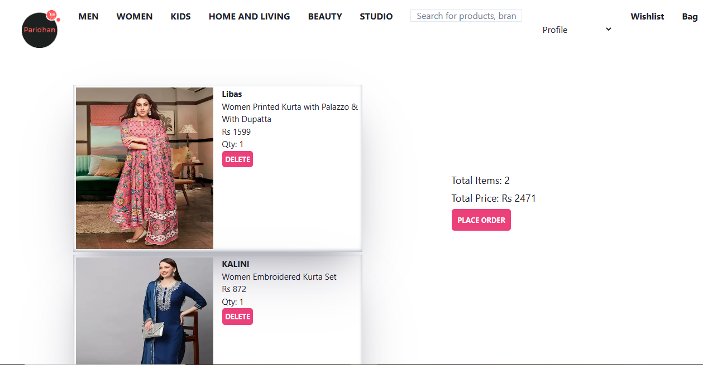

# Paridhan (Clone of Myntra)

Myntra is a one stop shop for all the fashion and lifestyle needs. Being India's largest e-commerce store for fashion and lifestyle products, Myntra aims at providing a hassle free and enjoyable shopping experience to shoppers across the country with the widest range of brands and products on its portal. The brand is making a conscious effort to bring the power of fashion to shoppers with an array of the latest and trendiest products available in the country.

# Getting Started
To get started with the project, you will need to clone the repository to your PC .

# Tech Stack

## Frontend

- React
- HTML 
- CSS
- JavaScript
- React-Router-Dom
- Chakra UI

## Backend
- Json-Server

# Pages
- Home Page
- Login Page
- Product Description Page.
- Single Product Page
- Cart Page
- Admin Page

# Features
- Home Page
- Login
- Products Page - Filter and sort functionality.
- Product Description Page.
- Cart Page - Add and delete from cart functionality.

# Functionalities
- Slider on Home Page.
- Login.
- View Products.
- Filter products.
- Sort by Price.
- Add to Cart.

# Deployed Link :- [[https://dapper-syrniki-3ec5c0.netlify.app/](https://64ac035380902c1961574e29--hilarious-beijinho-a24b71.netlify.app/)]

# screenshot

## Landing Page
 

## Products Page
 

## Single Product Page
 

## Cart Page
 

